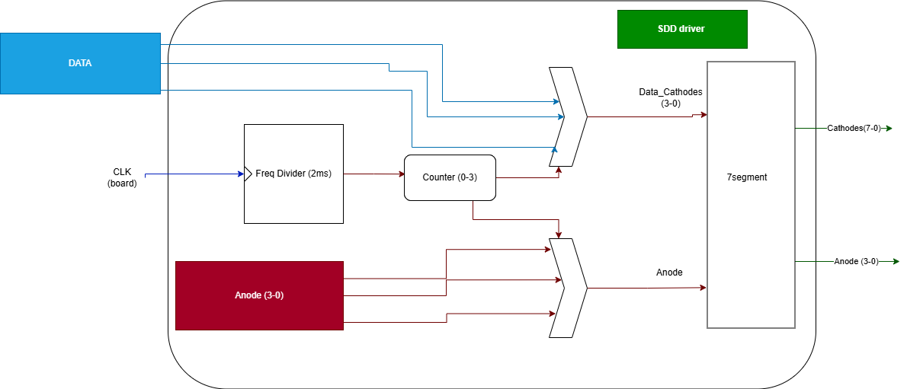

# Execitii DSD Suta pregatire Colocviu 

## Exerciții

* **[Exercițiul 1: Numărător pe 12 biți Up/Down](docs/ex1.md)** - Numărător reversibil sincron pe 12 biți, implementat structural prin înlănțuirea a trei module de 4 biți, cu reset asincron, încărcare paralelă și validare (enable).
* **[Exercițiul 2: Generator de Secvențe cu ROM](docs/ex2.md)** - Generator de secvențe pe 4 biți care citește dinamic o memorie ROM de $16 \times 4$ biți stocând trei funcții booleene specifice.
* **[Exercițiul 3: Unitate Aritmetico-Logică (ALU) Structurală](docs/ex3.md)** - ALU de 4 biți care realizează operații logice elementare (AND, OR, NAND, XOR) în paralel, selectate printr-un multiplexor ierarhic de tip $4 \times 4$.
* **[Exercițiul 4: Registru de Deplasare pe 4 biți](docs/ex4.md)** - Registru sincron de deplasare la dreapta cu bistabile de tip D și reset asincron.
* **[Exercițiul 5: Sistem cu Numărător și Registru](docs/ex5.md)** - Sistem format dintr-un numărător pe 4 biți interconectat la intrarea unui registru de 4 biți pentru capturarea valorii numărate prin încărcare paralelă sincronă.
* **[Exercițiul 6: Memorie RAM Generic și 64x16](docs/ex6.md)** - Modul generic de memorie RAM configurat în simulare ca RAM de 64x16 biți pentru scrierea la adrese impare a unui șir descrescător (128 la 97).
* **[Exercițiul 7: Generator de Semnal PWM pe 16 biți](docs/ex7.md)** - Modulator PWM pe 16 biți realizat dintr-un numărător sincron și un comparator, utilizând un prag de intrare citit de pe switch-uri pentru a varia intensitatea LED-urilor.
* **[Exercițiul 8: Numărător Up/Down pe 4 biți cu Multiplexor 2:1](docs/ex8.md)** - Sistem ce conține un numărător crescător și unul descrescător pe 4 biți, selectate printr-un multiplexor 2:1 și afișate în format binar pe LED-uri și pe SSD.
* **[Exercițiul 9: Unitate Aritmetico-Logică (ALU) pe 4 biți cu Memorie RAM 8x4](docs/ex9.md)** - Unitate aritmetico-logică capabilă de adunare fără transport, AND, OR și deplasare logică la dreapta cu 2 poziții, având rezultatul stocat într-o memorie RAM de 8x4 biți cu scriere controlată prin pin-ul WE.

---

## Documentație Comună: Driverul pentru Afișajul cu 7 Segmente (`ssd_driver`)

Afișajul cu 7 segmente de pe placa de dezvoltare (cum ar fi Basys 3) este un afișaj multiplexat format din 4 digite (cifre) individuale. Pentru a reduce numărul de pini necesari pe FPGA, toți cei 4 digiți partajează aceleași 8 linii de catozi (pentru segmentele A, B, C, D, E, F, G și DP), în timp ce anozii fiecărui digit sunt controlați separat (active-low).

Modulul `ssd_driver` permite afișarea a 4 valori hexazecimale independente (reprezentate pe 16 biți în total ca `Data(15 downto 0)`) prin tehnica **multiplexării în timp (Time Multiplexing)**.

### Structura Driverului `ssd_driver`
Driverul este alcătuit din două sub-componente și un proces de control:
1. **Divizorul de ceas (`CLK_Divider` / `divider`):** Încetinește ceasul rapid de pe placă (e.g. 100MHz) la un ceas de multiplexare de aproximativ 1kHz (`clk_aux`), oferind o frecvență optimă pentru comutarea anozilor.
2. **Decodorul de 7 segmente (`segment7b` / `converter`):** Convertește o valoare binară de 4 biți (`cathodes_data`) în semnalele corespunzătoare pentru cele 8 segmente (catozi, active-low).
3. **Procesul de selecție și contorul (`counter`):** Un contor intern care numără circular de la 1 la 4 pe fronturile crescătoare ale ceasului divizat (`clk_aux`).

### Principiul Multiplexării în Timp
Multiplexarea funcționează conform următoarei logici, dictată de semnalul `counter`:

* **Pasul 1 (`counter = 1`):**
  - Se activează anodul primului digit (dreapta): `Anodes <= "1110"` (activ pe low).
  - Se trimite spre catozi valoarea primilor 4 biți: `cathodes_data <= Data(3 downto 0)`.
* **Pasul 2 (`counter = 2`):**
  - Se activează anodul celui de-al doilea digit: `Anodes <= "1101"`.
  - Se trimite spre catozi valoarea biților: `cathodes_data <= Data(7 downto 4)`.
* **Pasul 3 (`counter = 3`):**
  - Se activează anodul celui de-al treilea digit: `Anodes <= "1011"`.
  - Se trimite spre catozi valoarea biților: `cathodes_data <= Data(11 downto 8)`.
* **Pasul 4 (`counter = 4`):**
  - Se activează anodul celui de-al patrulea digit (stânga): `Anodes <= "0111"`.
  - Se trimite spre catozi valoarea ultimilor 4 biți: `cathodes_data <= Data(15 downto 12)`.

### Persistența Retiniană (Remanența Vizuală)
Deoarece această comutare între cele 4 digite se face secvențial, în orice moment de timp **doar un singur digit este de fapt aprins**. Cu toate acestea, frecvența ceasului divizat `clk_aux` este suficient de mare încât fiecare digit este reîmprospătat de zeci de ori pe secundă. Ochiul uman nu poate detecta această comutare rapidă (fenomenul de persistență a imaginii pe retină) și percepe toate cele 4 digite ca fiind aprinse simultan și continuu.

---

## Schema Circuitului SSD Multiplexat

