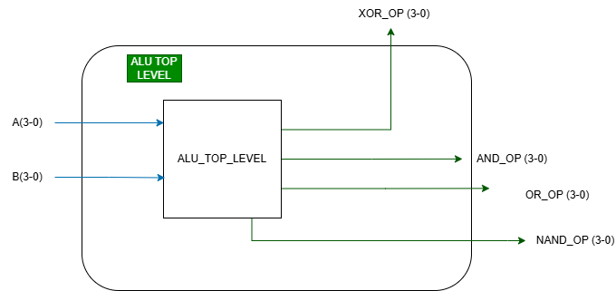
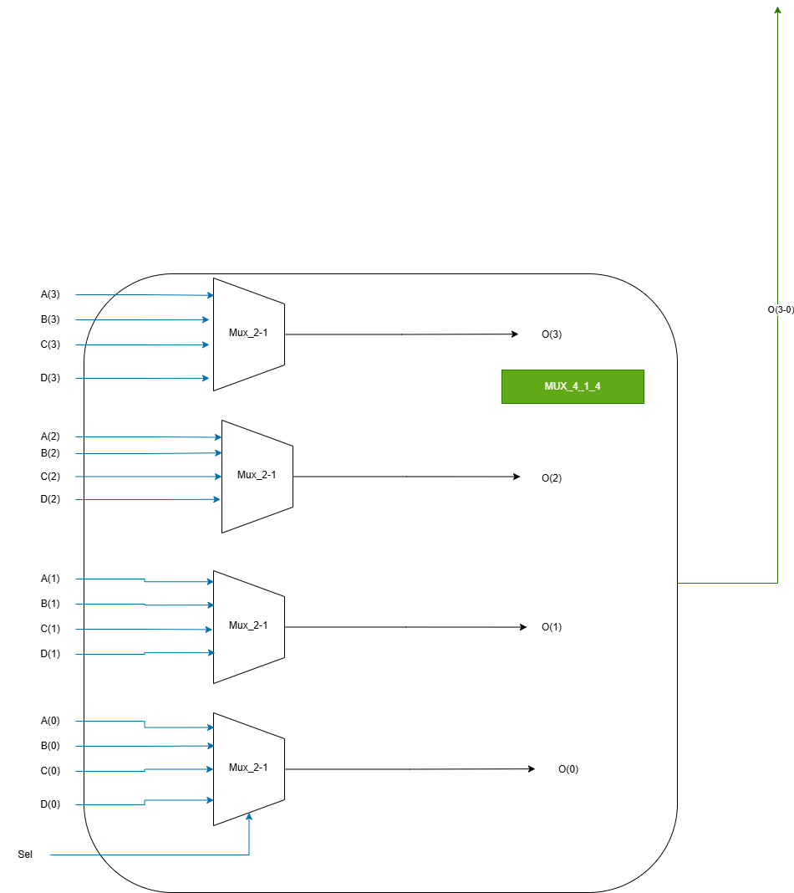

# Exercițiul 3: Proiectarea unei Unități Aritmetico-Logice (ALU) Structurale

## Cerință (Requirement)
> **Requirement:** Implement a system which has an ALU unit which can execute simple logic bitwise operations (choose any 4 operations) on 4bit inputs and a 4 to 1 MUX which will allow the user to select the desired operation to be seen on the 4bit system's output.

---

## Structura și Funcționarea ALU

Acest proiect implementează o Unitate Aritmetico-Logică (ALU) simplă pe 4 biți, utilizând o abordare structurală cu porți logice în paralel și un multiplexor de selectare custom.

ALU efectuează în paralel patru operații logice elementare pe biții a două intrări pe 4 biți, `A` și `B`:
- **AND** (`A and B`)
- **OR** (`A or B`)
- **NAND** (`A nand B`)
- **XOR** (`A xor B`)

Rezultatele acestor operații sunt direcționate către un multiplexor de selectare pe 4 biți (`Mux_4_4`), care alege rezultatul final `Ouptut_Alu` în funcție de magistrala de selecție `Sel` (2 biți).

### Tabelul de Selecție al ALU

| Selecție (`Sel`) | Operație Executată | Expresie Logică în VHDL | Descriere |
| :---: | :---: | :---: | :--- |
| `"00"` | **AND** | `A and B` | Intersecție logică pe biți |
| `"01"` | **OR** | `A or B` | Reuniune logică pe biți |
| `"10"` | **NAND** | `A nand B` | Negarea intersecției logice |
| `"11"` | **XOR** | `A xor B` | Disjuncție exclusivă (sau exclusiv) |

---

## Arhitectura Structurală a Multiplexorului `Mux_4_4`

Componenta `Mux_4_4` este implementată structural folosind patru instanțe ale unui multiplexor de câte 1 bit cu 4 intrări (`Mux_4_1`). 

### Logica de redistribuire a biților:
Fiecare `Mux_4_1` se ocupă de selecția unui singur bit din rezultatul final:
- **`Mux_1`** selectează bitul 0 (`O(0)`) din intrările: `Input_4(0)`, `Input_3(0)`, `Input_2(0)` și `Input_1(0)`.
- **`Mux_2`** selectează bitul 1 (`O(1)`) din intrările: `Input_4(1)`, `Input_3(1)`, `Input_2(1)` și `Input_1(1)`.
- **`Mux_3`** selectează bitul 2 (`O(2)`) din intrările: `Input_4(2)`, `Input_3(2)`, `Input_2(2)` și `Input_1(2)`.
- **`Mux_4`** selectează bitul 3 (`O(3)`) din intrările: `Input_4(3)`, `Input_3(3)`, `Input_2(3)` și `Input_1(3)`.

Toate cele patru multiplexoare `Mux_4_1` partajează aceeași intrare de selecție `Sel` (pe 2 biți).

---

## Diagrame Structurale (Draw.io)

Pentru acest exercițiu, se recomandă desenarea a două diagrame pe Draw.io și salvarea lor în folderul `../images/`:

1. **Diagrama Top-Level ALU (`alu_top.png`):**
   - Arată cele două intrări pe 4 biți `A` și `B` conectate în paralel la cele 4 blocuri de operații (`AND`, `OR`, `NAND`, `XOR`).
   - Ieșirile acestor blocuri merg ca intrări în componenta `Mux_4_4`.
   - Semnalul `Sel` (2 biți) intră în `Mux_4_4`, iar ieșirea acestuia este `Output_Alu` (4 biți).
   
   

2. **Diagrama Detaliată `Mux_4_4` (`mux_4_4.png`):**
   - Arată cum cele 4 intrări pe 4 biți (`Input_1` la `Input_4`) sunt descompuse pe biți individuali.
   - Arată cele 4 blocuri de `Mux_4_1`, fiecare primind câte un bit de la fiecare intrare și având semnalul comun `Sel`.
   - Ieșirile lor individuale pe 1 bit (`O(0)` până la `O(3)`) se reunesc pentru a forma magistrala de ieșire pe 4 biți `O`.
   
   
