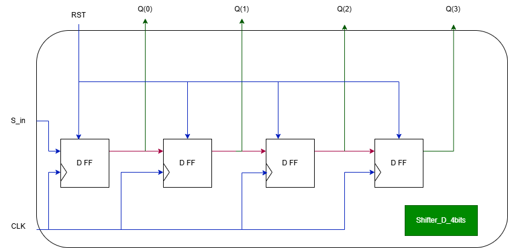

# Exercițiul 4: Proiectarea unui Registru de Deplasare pe 4 biți

## Cerință (Requirement)
> **Requirement:** Implement a 4bit register which can be reseted asynchronously and which can shift in one direction. You must use D flip flops to implement this register.

---

## Descrierea Funcționării

### 1. Structura Registrului de Deplasare (`Shift_reg`)
Registrul de deplasare pe 4 biți este implementat structural prin înlănțuirea a 4 bistabile de tip D (`D_FF`):
- Bistabilele au un semnal de reset asincron comun (`RST`) care le aduce starea la `'0'`.
- Ceasul de deplasare (`CLK_1sec`) este obținut prin divizarea ceasului principal de pe placă folosind modulul `Clk_div` (factor de divizare generat la `1000`).
- Datele seriale intră prin `S_in` în primul bistabil și sunt deplasate spre dreapta (de la bistabilul 0 spre bistabilul 3) la fiecare front crescător de ceas slow.

---

## Sistemul de Afișare (LED-uri și 7-Segment)

Ieșirea pe 4 biți a registrului de deplasare (`Q_out_aux`) este vizualizată pe placă prin două metode:

1. **LED-urile plăcii (`Data_leds`):**
   - Afișează starea directă pe 4 LED-uri, unde fiecare LED corespunde unui bit din registru.

2. **Afișajul pe 7 Segmente (SSD):**
   - Pentru afișare, fiecare bit individual al registrului este convertit (padded) la formatul pe 4 biți prin modulele `Conv_bin` (unde `'0'` devine `"0000"`, iar `'1'` devine `"0001"`).
   - Aceste valori expandate sunt concatenate într-o magistrală comună de 16 biți (`Data_aux`) trimisă către driverul general de afișare (`ssd_driver`), permițând vizualizarea în format binar (cifrele `0` și `1`) pe cele 4 digite (anozi) ale plăcii.

---

## Schema Top Level a Circuitului

