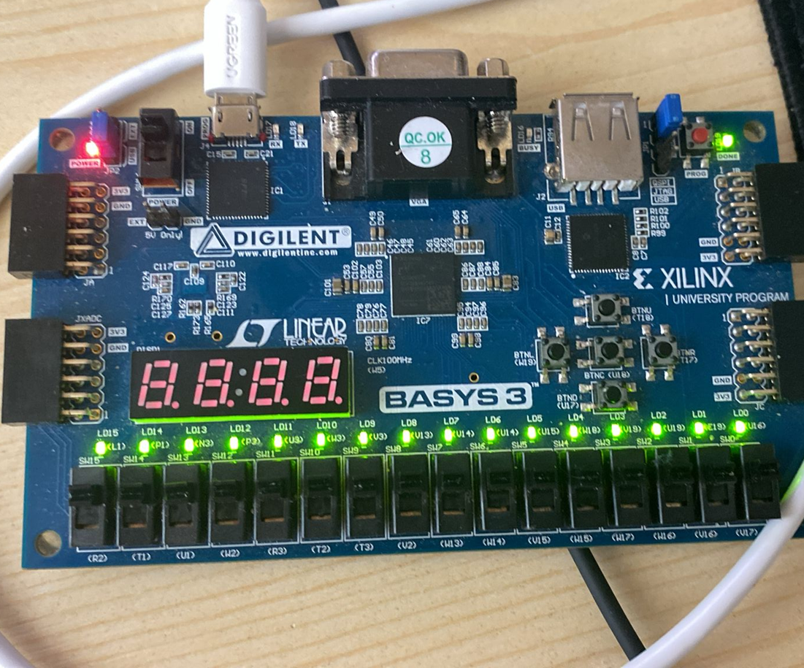
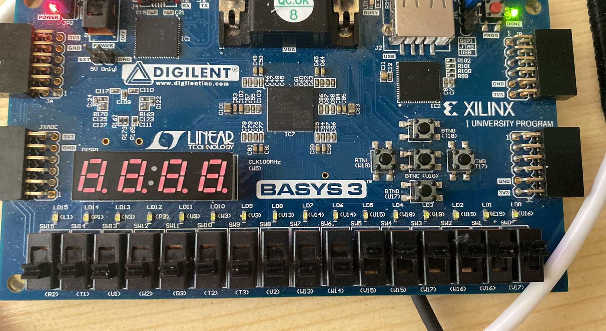

# Exercițiul 7: Generator de Semnal PWM pe 16 biți

## Cerință (Requirement)
> **Requirement:** Implement a PWM generator which uses a counter on 16bit and a 16bit comparator. The system will maintain a 1bit output value on '1' logic as long as the counter's output value is below a threshold value from input (16bit). Otherwise the 1bit output will be '0'.

---

## Descrierea Funcționării

Sistemul implementează un **Modulator cu Lățime de Impuls (PWM - Pulse Width Modulation)** pe 16 biți. Acesta este utilizat pentru a controla puterea medie livrată unui consumator (în acest caz, luminozitatea medie a celor 16 LED-uri de pe placă) prin modificarea factorului de umplere (duty cycle) al semnalului de ieșire.

### Principiul de Generare PWM
* Valoarea de prag (threshold) este citită de pe cei 16 biți ai switch-urilor plăcii ca magistrală de intrare `Val`.
* Un contor pe 16 biți incrementat de ceasul rapid al plăcii (`100 MHz`) rulează continuu de la `0` la `65535` ($2^{16} - 1$).
* Un comparator pe 16 biți compară constant valoarea curentă a contorului ($A$) cu pragul setat de utilizator ($B = \text{Val}$):
  * Cât timp valoarea contorului este strict mai mică decât pragul ($A < B$), ieșirea sistemului este în logică `'1'` (LED-urile sunt aprinse).
  * Când contorul depășește sau ajunge la valoarea pragului ($A \ge B$), ieșirea devine `'0'` (LED-urile se sting).
* Factorul de umplere al semnalului generat este definit de relația:
  $$D = \frac{\text{Val}}{2^{16}}$$
* Deoarece ceasul plăcii are $100\text{ MHz}$, perioada de numărare completă a celor $2^{16}$ stări determină o frecvență a semnalului PWM de:
  $$f_{\text{PWM}} = \frac{100\text{ MHz}}{65536} \approx 1.526\text{ kHz}$$
  Această frecvență este suficient de mare pentru ca ochiul uman să nu perceapă clipirea LED-urilor, observând în schimb modificarea intensității lor luminoase (de la stins complet la `Val = 0` până la luminozitate maximă la `Val = 65535`).

---

### 1. Componentele Sistemului

Sistemul este realizat structural din următoarele module VHDL:

1. **Numărătorul pe 16 biți (`Counter_16_bit`):**
   - Incrementat pe frontul crescător al ceasului principal (`CLK`).
   - Dispune de un port de reset asincron (`RST`) care aduce valoarea contorului la `x"0000"`.
   - Trimite starea sa pe magistrala de 16 biți `Q_out`.

2. **Comparatorul pe 16 biți (`Comparator_16bit`):**
   - Compară cele două intrări pe 16 biți: `A` (valoarea contorului) și `B` (pragul `Val`).
   - Oferă o ieșire pe 3 biți `O` codificată astfel:
     - `O <= "001"` pentru $A < B$
     - `O <= "010"` pentru $A = B$
     - `O <= "100"` pentru $A > B$

3. **Debouncer-ul (`MPG` - Mono-Pulse Generator):**
   - Modul utilizat pentru filtrarea zgomotului mecanic cauzat de apăsarea butonului de reset.

4. **Modulatorul Top-Level (`PWM_modulator`):**
   - Conectează structural componentele descrise mai sus.
   - Conectează magistrala de ieșire a comparatorului (`Out_comp`) la logica de ieșire a celor 16 LED-uri:
     `Leds_out <= (others => '1') when Out_comp = "001" else (others => '0');`

---

## Schema Structurală a Circuitului

---

## Demonstrație Practică (Placă Basys 3)

Aici sunt prezentate imagini cu comportamentul LED-urilor de pe placa de dezvoltare în funcție de pragul de umplere (Duty Cycle) selectat prin intermediul switch-urilor:

### 1. Luminozitate Maximă (Duty Cycle 100% - Toate switch-urile pe '1')

### 2. Luminozitate Scăzută (Duty Cycle mic - Switch-uri pe poziții de valori mici)

